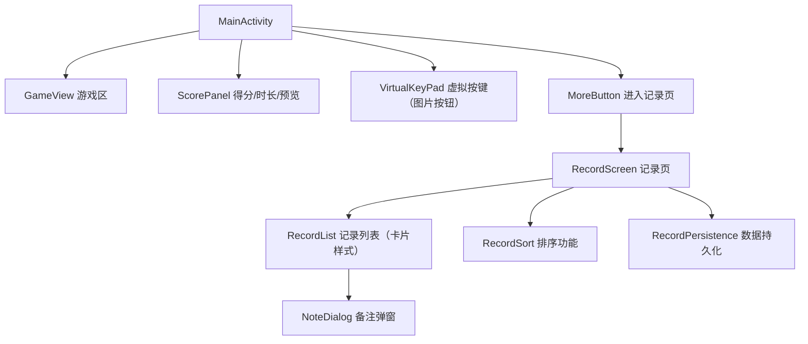
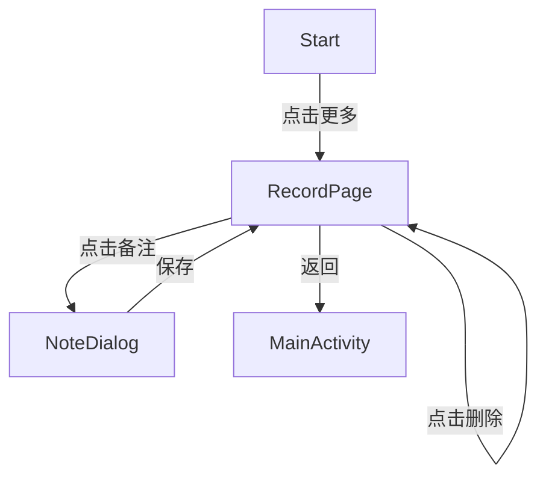

# 你的姓名_俄罗斯方块详细设计说明书

## 一、背景
俄罗斯方块是一款经典的益智游戏，因其简单易上手、极具挑战性而广受欢迎。随着移动设备的普及，开发一款基于Android平台的俄罗斯方块App，既能锻炼开发者的移动开发能力，也能为用户带来休闲娱乐体验。本项目旨在实现一个包含游戏主界面、成绩记录、备注弹窗等功能的俄罗斯方块Demo。

## 二、设计目标
1. 实现俄罗斯方块核心玩法（方块下落、移动、旋转、消除等），支持自定义View绘制。
2. 实现游戏时长计时、得分统计、下一个图形预览（Canvas绘制）。
3. 支持虚拟按键操作，方向键为图片按钮，布局对称美观。
4. 提供历史记录管理（含日期、得分、时长、备注），支持排序、删除、备注编辑。
5. 支持备注弹窗编辑、复制、粘贴。
6. UI简洁美观，交互流畅，适配不同屏幕。
7. 数据本地持久化，支持多次游戏记录。

## 三、目标拆解
- 游戏主界面模块（Compose+自定义View）
- 游戏逻辑与渲染模块（GameEngine+GameView）
- 虚拟按键控制模块（图片按钮，布局对称）
- 记录管理模块（Compose+本地存储）
- 备注弹窗模块（Compose Dialog，支持复制粘贴）
- 数据持久化模块（SharedPreferences+Gson）

## 四、详细实现
### 1. 整体实现框架

### 2. 各功能点设计与实现方案
#### 2.1 游戏主界面
- 使用`MainActivity`作为入口，Compose布局，左侧为游戏区，右侧为得分、预览、虚拟按键、更多按钮。
- 顶部“游戏时长”“得分”为圆角卡片，字体加粗。
- 游戏区为自定义View，支持方块渲染、动画、网格线、圆角背景。
- 右侧“下一个图形预览区”为Canvas绘制，卡片样式。
- 虚拟按键区为卡片，四个方向按钮均为图片，大小一致，布局对称，上下对齐。
- “更多”按钮为圆角主色卡片。

#### 2.2 游戏逻辑与渲染
- 方块数据结构：二维数组表示棋盘，枚举表示方块类型。
- 方块移动、旋转、下落逻辑封装在GameEngine类。
- 支持下一个方块预览（nextBlock）。
- 消除检测与分数计算，游戏结束自动弹窗。

#### 2.3 虚拟按键控制
- 虚拟按键区自定义布局，四个方向按钮（图片），上排中间按钮向上偏移与下排对称。
- 点击按钮控制方块移动、旋转、下落。
- 图片资源放置于res/drawable目录。

#### 2.4 记录管理
- 记录页`RecordScreen`，Compose实现，历史记录为卡片样式，主字段加粗，分隔线清晰。
- 支持按得分/日期排序，顶部切换按钮。
- 支持纵向滑动，性能高效。
- 每条记录右侧有“编辑备注”按钮，弹窗支持备注编辑、复制、粘贴。
- 每条记录右侧有“删除”按钮，支持一键删除。
- 记录页底部有“返回”按钮。
- 备注内容支持复制粘贴。
- 记录总数统计（可选）。

#### 2.5 备注弹窗
- 备注为弹窗（AlertDialog），支持文本编辑、复制、粘贴。
- 编辑后自动保存到本地，记录页实时刷新。

#### 2.6 数据持久化
- 使用SharedPreferences+Gson存储记录。
- 记录包括日期、得分、时长、备注。
- 备注编辑、删除等操作均自动同步本地数据。

### 3. 关键流程图

## 五、影响范围
- 新增多个Compose Composable、自定义View类、数据类。
- 影响主界面布局、数据存储结构、图片资源管理。
- 需适配不同屏幕尺寸。

## 六、自测用例
1. 启动App，进入主界面，游戏区正常显示。
2. 方块可通过虚拟按键（图片按钮）移动、旋转、加速下落。
3. 消除行后得分增加，计时器正常计时。
4. 点击“更多”进入记录页，历史记录正常显示。
5. 记录页支持滑动、排序、删除。
6. 点击“编辑备注”弹出编辑弹窗，内容可复制粘贴，保存后实时刷新。
7. 记录数据重启后依然存在。
8. 游戏结束弹窗显示得分和时长，可一键重新开始。

## 七、输出总结及参考资料
本Demo实现了俄罗斯方块游戏的核心玩法及成绩记录、备注管理等功能，界面简洁，交互流畅，UI美观，体验良好。为后续功能扩展和优化提供了良好基础。

**参考资料：**
- Android官方开发文档
- 俄罗斯方块游戏原理相关资料
- [Jetpack Compose官方文档](https://developer.android.com/jetpack/compose) 